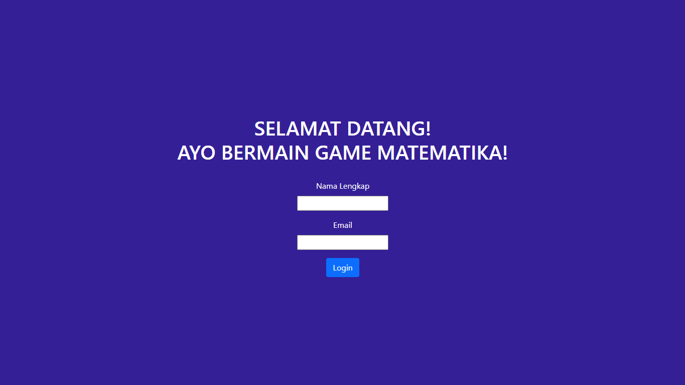
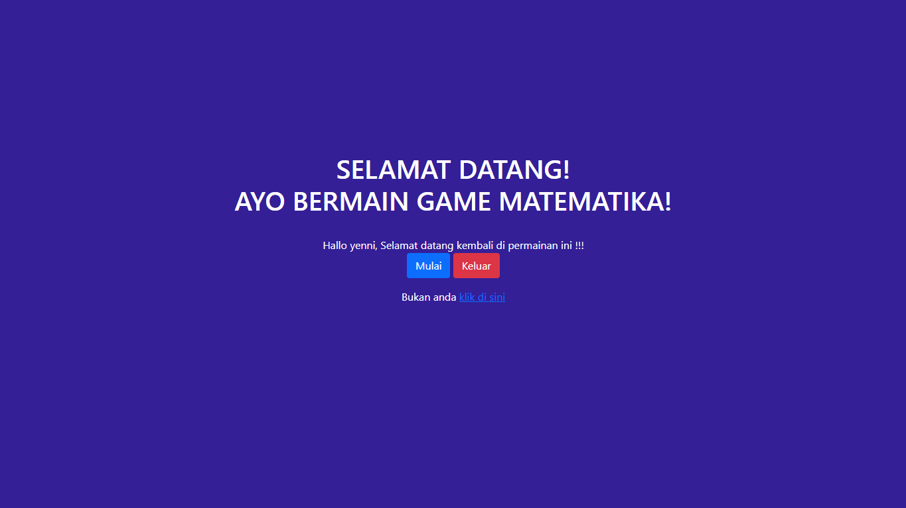
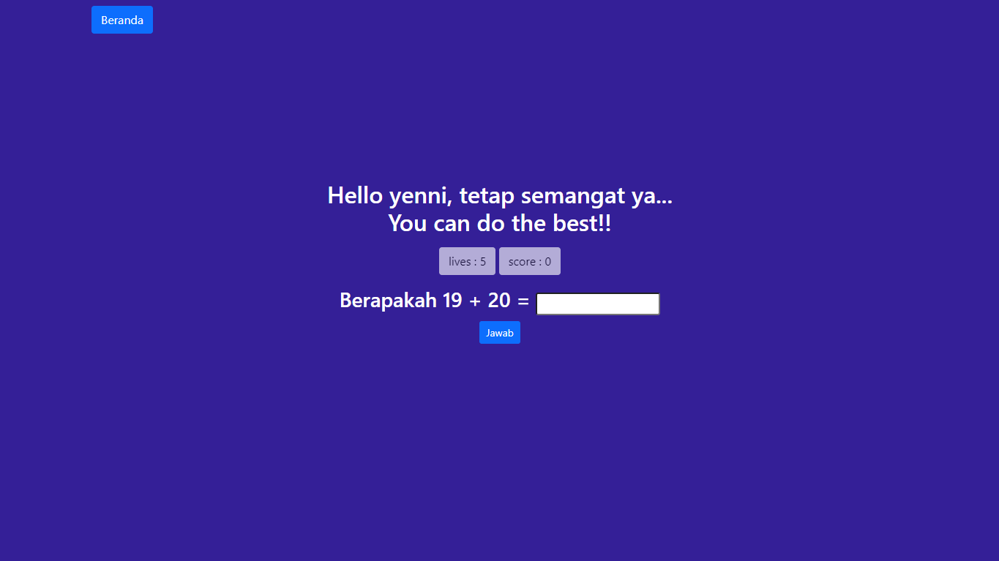
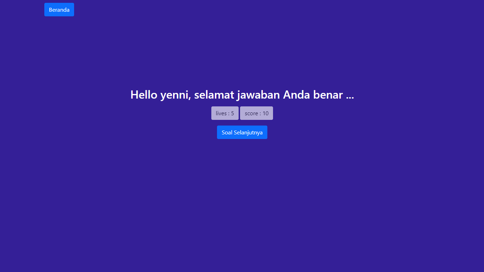
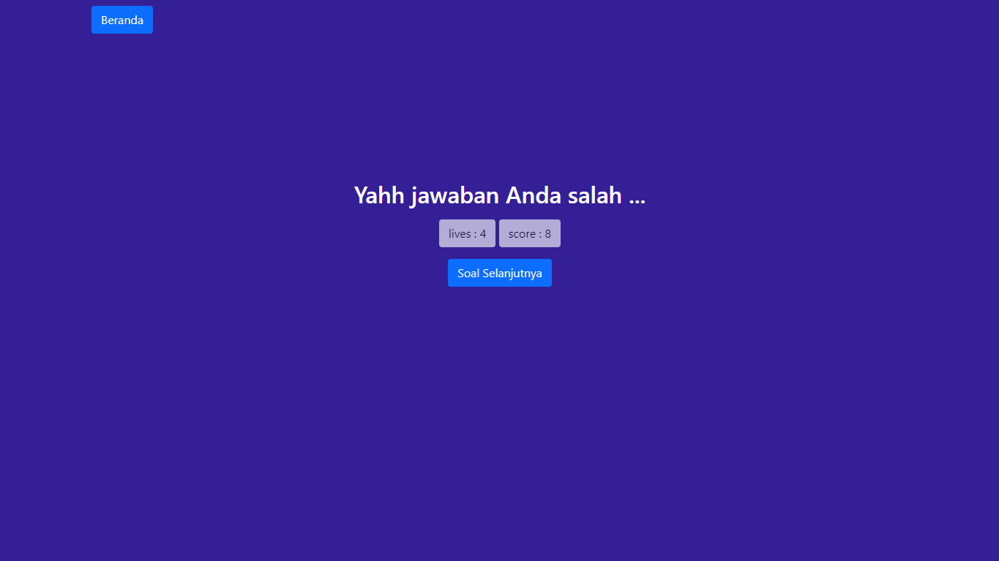
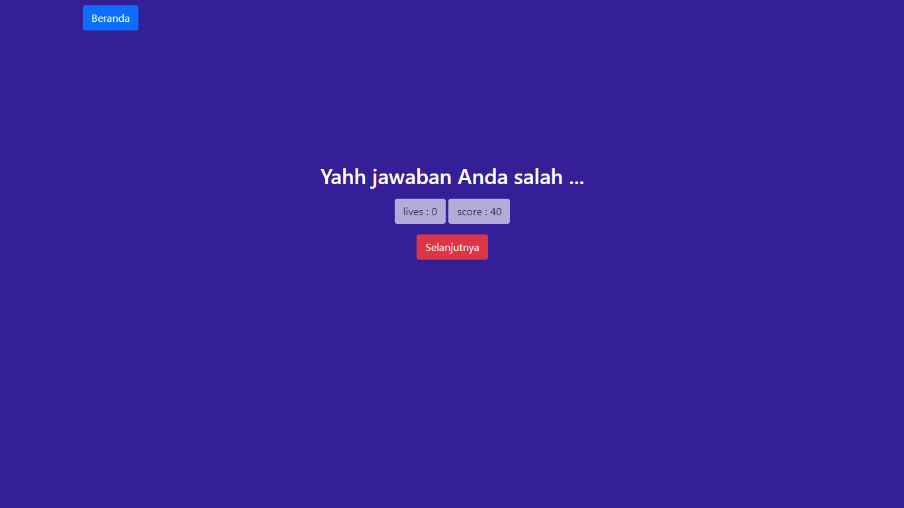
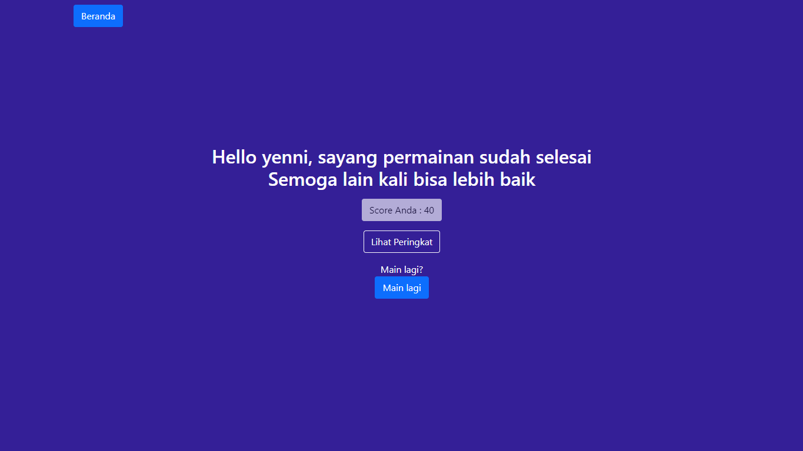
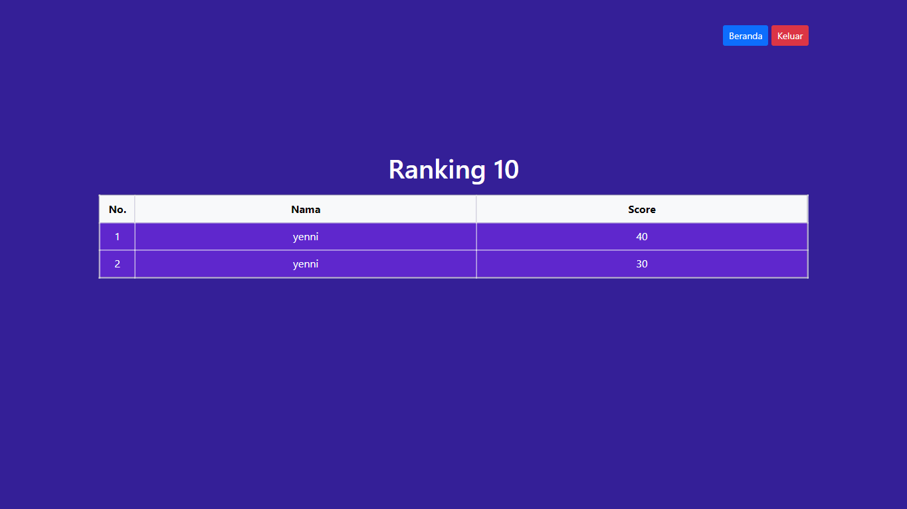

# PROJECT UTS PEMROGRAMAN WEB - GAME MATEMATIKA
## Yenni Veronika - K3519078 

Pada awal mengunjungi website, akan menampilkan form login jika player belum login sebelumnya. Ketika player sudah login, maka akan ditampilkan pesan selamat datang kembali dan ada tombol mulai game dan logout. Ketika player meng-klik tombol mulai, maka dua angka akan terandom ditampilkan dalam bentuk penjumlahan, lives diset menjadi 5, dan score dimulai dari 0. terdapat form untuk menjawab soal tersebut. jika jawaban player benar, maka skor akan bertambah 10. sebaliknya, jika player menjawab dengan salah, maka skor akan berkurang 2 dan lives akan berkurang 1. ketika lives mencapai 0, maka game akan selesai dan menampilkan skor terakhir yang didapat. setelah itu ada opsi untuk menampilkan ranking 10 tertinggi dari player-player lain.

 

# **Tampilan Awal Website**

 tampilan awal dari website 

# **Tampilan Setelah Login**

 tampilan awal dari website setelah login 

# **Tampilan Awal Game**

 tampilan awal dari game 

# **Tampilan Ketika Menjawab Dengan Benar**

 tampilan saat bisa menjawab dengan benar 

# **Tampilan Ketika Menjawab Dengan Salah**

 tampilan saat menjawab salah 

# **Tampilan Ketika Nyawa Sudah Mencapai 0**

 tampilan awal saat nyawa mencapai 0, tombol soal selanjutnya berganti menjadi selanjutnya dengan warna merah 

 tampilan akhir ketika nyawa sudah mencapai 0, menampilkan skor terakhir yg didapat dan tombol ranking 

# **Tampilan Leaderboard**

 tampilan tabel ranking 10 besar 

 

## Link Website : http://k3519078.epizy.com/
